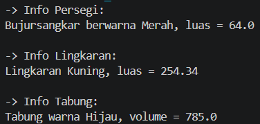

Tugas 5C - Latihan/Eksplorasi Materi Inheritance dan Polymorphism

Nama: Andre Astamam

NIM: F1D02410103

1. Encapsulation (Enkapsulasi)
Letak pada Kode:
Penerapan ini terlihat dari penggunaan protected String warna pada kelas Bentuk, protected double radius pada kelas Lingkaran, dan private double sisi pada kelas Persegi, serta private double tinggi pada kelas Tabung. Atribut-atribut ini tidak bisa diakses langsung dari kelas Main. Untuk membaca dan mengubah nilainya, saya menggunakan metode getter dan setter, misalnya getWarna(), setWarna(), getRadius(), setRadius(), getSisi(), setSisi(), getTinggi(), dan setTinggi(). Atribut protected masih bisa diakses oleh kelas turunan, sedangkan atribut private hanya bisa diakses di kelasnya sendiri.
2. Inheritance (Pewarisan)
Letak pada Kode:
Penerapan ini ditandai dengan penggunaan kata extends. Contohnya pada baris class Persegi extends Bentuk dan class Lingkaran extends Bentuk. Ada juga pewarisan bertingkat pada baris class Tabung extends Lingkaran, sehingga Tabung mewarisi Lingkaran sekaligus Bentuk. Di dalam constructor, kelas anak memakai perintah super() untuk memanggil constructor kelas induknya, misalnya super(warna) pada Persegi dan Lingkaran, serta super(radius, warna) pada Tabung. Dengan pewarisan ini, atribut warna tidak perlu ditulis ulang di setiap kelas anak, dan Tabung bisa langsung memakai hitungLuas() milik Lingkaran di dalam hitungVolume().
3. Polymorphism (Polimorfisme)
Letak pada Kode:
Ini terjadi pada metode printInfo(). Kelas induk Bentuk punya metode ini, lalu kelas anak (Persegi, Lingkaran, Tabung) menulis ulang (override) metode tersebut dengan isi yang berbeda. Pada kelas Main, semua objek dideklarasikan dengan tipe Bentuk, misalnya Bentuk bujurSangkar = new Persegi(8.0, "Merah");, Bentuk lingkaran = new Lingkaran(9.0, "Kuning");, dan Bentuk silinder = new Tabung(10.0, 5.0, "Hijau");. Meskipun tipe variabelnya sama, saat printInfo() dipanggil, Java menjalankan versi metode sesuai objek aslinya. Akibatnya, Persegi mencetak luas = 64.0, Lingkaran mencetak luas = 254.34, dan Tabung mencetak volume = 785.0.
Screenshot Hasil Eksekusi

Berikut adalah bukti saat program dijalankan:

